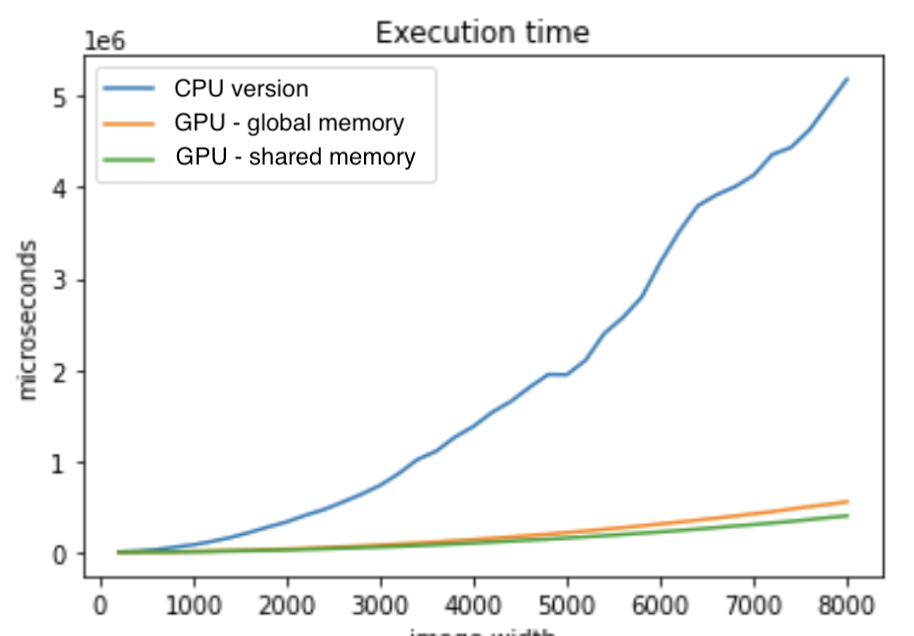

# Intro 

This repository contains an implementation of [Local Binary Pattern algorithm](https://en.wikipedia.org/wiki/Local_binary_patterns) algorithm using GPU acceleration in CUDA C. This project is intended to compare speed performances wrt to CPU version ([sequential](https://github.com/MarcoSolarino/LBPSequential/tree/master) and [OpenMP](https://github.com/sim-pez/LBP_OpenMP)) of this algorithm.


# Usage

- Place an image in .jpg format in ```input/``` folder
- Run the program specifying the image name like
```
LBPSequential imgname.jpg
```
- At the end of the run an histogram will be generated in ```output/```

# Test

We compared running time of three versions of algorithms:
- Simple CPU version
- Non-optimized GPU accelerated version that uses only global memory
- Optimized GPU accelerated version using also shared memory

These are mean running time to process 200x200 size image on a GeForce GTX 980 Ti

<p float="left" align="center">
  
</p>


# Other versions

- [squential C++ version](https://github.com/MarcoSolarino/LBPSequential/tree/master)
- [OpenMP version](https://github.com/daikon899/LBP_OpenMP)


# Acknowledgments
Parallel Computing - Computer Engineering Master Degree @[University of Florence](https://www.unifi.it/changelang-eng.html)
