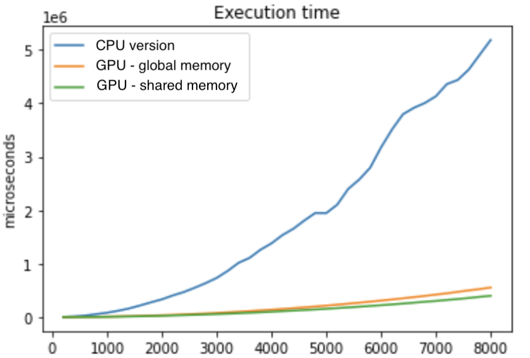

# Intro 

This repository contains an implementation of [Local Binary Pattern](https://en.wikipedia.org/wiki/Local_binary_patterns) algorithm using GPU acceleration in CUDA C. 
This project is made to compare speed performances wrt sequential [CPU-only version](https://github.com/MarcoSolarino/LBPSequential/tree/master) implementation.


# Usage

- Place an image in .jpg format in ```input/``` folder
- Run the program specifying the image name, for example ```LBPSequential imgname.jpg```
- At the end of the run an histogram will be generated in ```output/```

# Performances

We compared running time between three different implementations:
- Simple **sequential** CPU version
- Non-optimized GPU accelerated version that uses only **global memory**
- Optimized GPU accelerated version using also **shared memory**

<p align = "center">

</p>
<p align = "center">
Running time for different sizes of a square image
</p>


We could reach up to ***15x speed-up*** on GeForce GTX 980 Ti.


# More details
For a detailed description of code implementation and tests you can check our [report](/docs/report.pdf). (_available only in italian language, sorry_)

We also made a similar comparison between CPU-only sequential vs CPU-only [multithread version](https://github.com/sim-pez/LBP_OpenMP) with OpenMP.


# Acknowledgments
Parallel Computing - Computer Engineering Master Degree @[University of Florence](https://www.unifi.it/changelang-eng.html).
